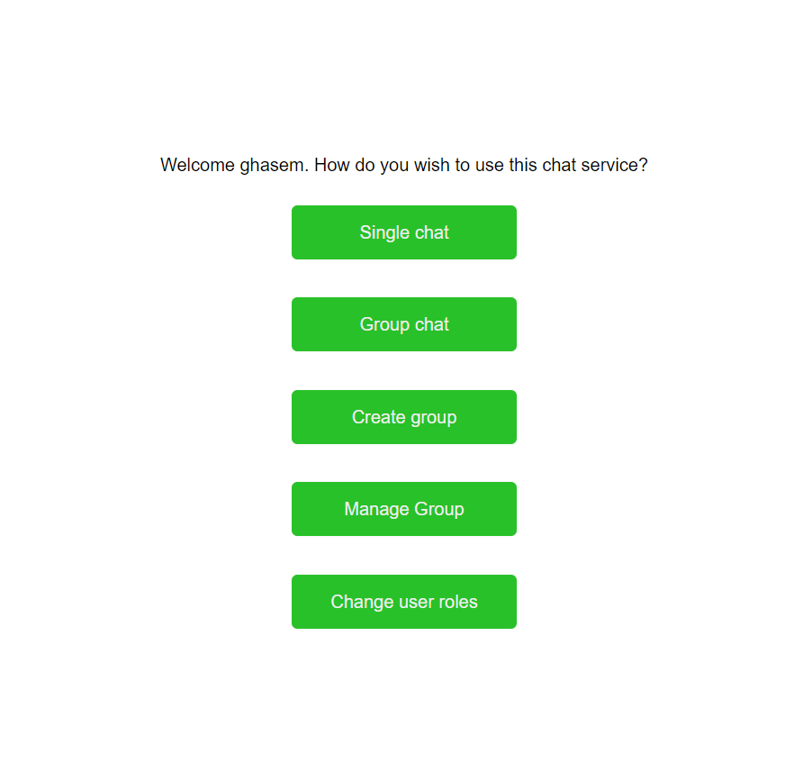
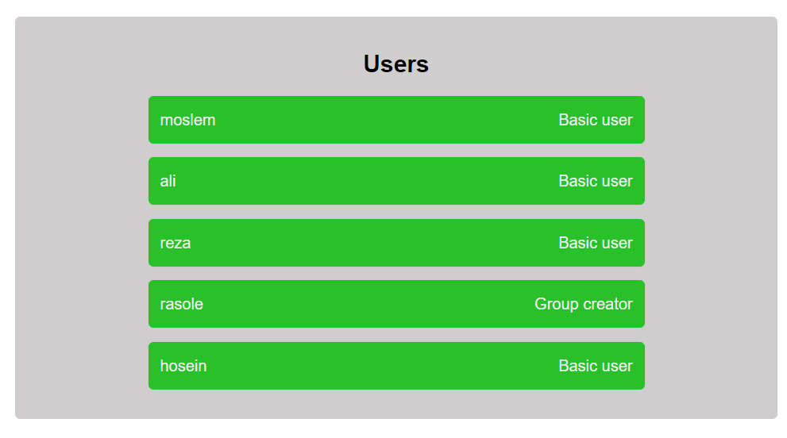
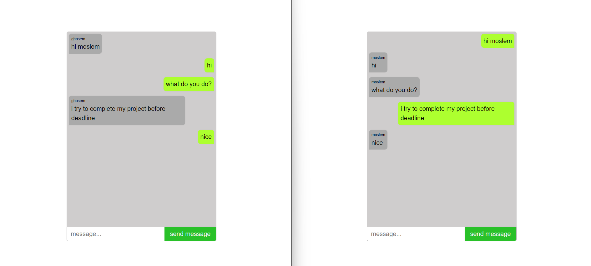

# Chat application

this is a simple chat application implemented with React in frontend and Node.js in backend.
in this application, users can sign up with email and choose a username for themselves, then they can ligin with that username and password. this application have three roles: admin, simple user and group user.
admin can see other users and change their roles and he can change a specific group like add users, delete users and delete group.
simple user can only have single chat (p2p chat). he can'nt create a group and just can chat in the groups that is a member of the them.
group user, in addition to simple user can create a group and add users to it.
when users login, its password will be hashed in the backend and then save in the database. when user wants to login, the candidate password will be hashed and compared with the hashed password that saved in the database and then he can access to chat application.
when user want to send a message to another user, the message encrypted with with sender private key, and for signing, the result encrypted with receiver public key.
the user that want to receive the message, first decrypt the message with it's own private key and then encrypt the result, with sender public key.
in group chat scenario, the group have a table of users with their public keys. when a user sends a message to group, other members decrypt the message with sender public key.

thank's to all the people that help us in this project.

group members:
Iman Movaghar 4001262115
Mohammad Ghajari 4001262079

# User Model Explanation

This is a Mongoose model for a User in a Node.js application. The model defines the structure of the user data stored in a MongoDB database.

## Dependencies

The model uses the following dependencies:

-   `mongoose`: A MongoDB ORM for Node.js.
-   `bcryptjs`: A password hashing library for Node.js.
-   `validator`: A library for validating user input.
-   `crypto`: A built-in Node.js library for cryptographic functions.
-   `NodeRSA`: A library for generating and managing RSA keys.

## Usage

install dependencies:

```bash
npm install
```

Run backend:

```bash
npm run start:dev
```

Run frontend:

```bash
npm run dev
```

## Schema Definition

The user schema is defined using Mongoose's Schema object. The schema defines the following fields:

-   **username**: A required string field with a unique index.
-   **email**: A required string field with a unique index and email validation.
-   **password**: A required string field with a minimum length of 8 characters. The password is hashed using bcryptjs before being stored in the database.
-   **passwordConfirm**: A required string field that must match the password field.
-   **salt**: A string field used for password hashing.
-   **publicKey**: A string field that stores the user's public RSA key.
-   **privateKey**: A string field that stores the user's private RSA key.
-   **role**: A string field that defines the user's role, with possible values of 'user', 'group', or 'admin'.

## Pre-Save Hook

The model defines a pre-save hook using Mongoose's `pre` method. This hook is executed before the user data is saved to the database. The hook performs the following tasks:

-   Generates a salt using bcryptjs and stores it in the `salt` field.
-   Hashes the password using bcryptjs and stores it in the `password` field.
-   Generates a new RSA key pair using NodeRSA and stores the public and private keys in the `publicKey` and `privateKey` fields, respectively.

## Model Creation

The model is created using Mongoose's `model` method, which returns a Mongoose model instance. The model is then exported as a module.

# Mongoose Model for Group Chat

This code defines a Mongoose model for a group chat, which is a document-based database schema for storing group chat data.

## Schema Definition

The `groupChatSchema` is defined using the `mongoose.Schema` constructor. It specifies the structure of the group chat document, which consists of three fields:

1. **username**
    - Type: String
    - Required: true (must have a username)
    - Unique: true (username should be unique)
2. **owner**
    - Type: ObjectId (reference to another document)
    - Ref: 'Suser' (references the Suser model)
    - Required: true (must have an owner)
3. **users**
    - Type: Array of ObjectIds (references to other documents)
    - Ref: 'Suser' (references the Suser model)

## Schema Options

The schema is created with two options:

-   `toJSON: { virtuals: true }`: includes virtual properties in the JSON output
-   `toObject: { virtuals: true }`: includes virtual properties in the object output

## Pre Hook

A pre-hook is defined for the `find` method (and all methods that start with `find`, such as `findOne`, `findById`, etc.). This hook populates the `users` field with the `username` and `publicKey` fields from the referenced Suser documents.

## Model Creation

The `GroupChat` model is created using the `mongoose.model` method, passing the `groupChatSchema` and the model name 'SgroupChat'.

## Export

The `GroupChat` model is exported as a module.

In summary, this code defines a Mongoose model for a group chat, which has a unique username, an owner, and a list of users. The model includes a pre-hook to populate the `users` field with additional data from the referenced Suser documents.

# authController.js

## Importing Dependencies

The code starts by importing several dependencies:

-   `catchAsync` from `./../utils/catAsync` (likely a wrapper for handling asynchronous errors)
-   `AppError` from `./../utils/appError` (a custom error class)
-   `User` from `./../model/userModel` (a Mongoose model for users)
-   `jwt` from `jsonwebtoken` (a library for generating JSON Web Tokens)
-   `bcrypt` from `bcryptjs` (a library for hashing passwords)
-   `promisify` from `util` (a utility function for promisifying callback-based functions)

## Defining Utility Functions

Two utility functions are defined:

### signToken(id)

Generates a JSON Web Token (JWT) with the given `id` as the payload. The token is signed with a secret key stored in `process.env.JWT_SECRET` and has an expiration time set to `process.env.JWT_EXPIRES_IN`.

### createSendToken(user, statusCode, res)

Creates a JWT token for the given user and sends it as a cookie in the response. Here's what it does:

1. Calls `signToken` to generate a token for the user's `_id` field.
2. Sets up a cookie option object with an expiration time calculated from the current time plus the `JWT_COOKIE_EXPIRES_IN` value in seconds.
3. Sets the `httpOnly` flag to `true` to prevent JavaScript access to the cookie.
4. Sets the `jwt` cookie in the response with the generated token and cookie options.
5. Removes the `password` field from the user object.
6. Returns a JSON response with a success status, the token, and the user data.

The `createSendToken` function is likely used after a successful user login or registration to send a token to the client, which can then be used for authentication in subsequent requests.

# Server Setup and Configuration

This code sets up a Node.js server using Express.js, Mongoose, and Socket.IO. Here's a breakdown of the code:

## Importing Modules

The code starts by importing the required modules:

-   `dotenv`: a module for loading environment variables from a `.env` file.
-   `express`: the Express.js framework for building web applications.
-   `mongoose`: a MongoDB ORM (Object Relational Mapping) tool for interacting with a MongoDB database.
-   `User`: a model for the User collection in the MongoDB database.
-   `http`: the built-in Node.js module for creating an HTTP server.
-   `Server`: the Socket.IO server module for real-time communication.
-   `cors`: a module for enabling Cross-Origin Resource Sharing (CORS) in the server.
-   `cookieParser`: a module for parsing cookies in HTTP requests.
-   `app`: the Express.js application instance, imported from another file (`./app`).

## Environment Variables and Configuration

The code loads environment variables from a file named `config.env` using `dotenv.config()`. This file is assumed to contain configuration settings for the application.

## Error Handling

The code sets up an error handler for uncaught exceptions using `process.on('uncaughtException', ...)`. When an uncaught exception occurs, the code logs the error and shuts down the process with a non-zero exit code (1).

## Server Creation

The code creates an HTTP server using `http.createServer()` and passes the Express.js application instance (`app`) as an argument.

## Socket.IO Setup

The code sets up a Socket.IO server using `new Server(server, {...})`, where `server` is the HTTP server created earlier. The Socket.IO server is configured to allow CORS (Cross-Origin Resource Sharing) requests from `http://localhost:8001` with the `GET` and `POST` methods, and to allow credentials (cookies, etc.) to be sent with requests.

# Mongoose Connection

The code connects to a MongoDB database using Mongoose. It retrieves the database connection string from the environment variables (`process.env.DATABASE`) and establishes a connection using `mongoose.connect()`. The `useNewUrlParser`, `useUnifiedTopology`, and `useCreateIndex` options are set to ensure compatibility with the latest MongoDB driver.

```javascript
const DB = process.env.DATABASE.replace(
    "<PASSWORD>",
    process.env.DATABASE_PASSWORD
);
mongoose
    .connect(DB, {
        useNewUrlParser: true,
        useUnifiedTopology: true,
        useCreateIndex: true,
    })
    .then(() => console.log("DB connection successful!"));
```

## GroupChat Component

This React component implements a group chat interface using various libraries and custom services.

### Dependencies

The component uses the following dependencies:

-   `react`: The core React library.
-   `react-redux`: For managing global state using Redux.
-   `socket.io-client`: For real-time communication with the server.
-   `jsencrypt`: For RSA encryption.
-   `styles/group-chat.module.css`: CSS module for styling the component.
-   `services/notify.js`: A custom service for displaying notifications.
-   `services/handleRequest.js`: Custom services for making HTTP requests to the server.
-   `state management/userSlice.js`: Redux slice for user-related state.
-   `state management/chatSlice.js`: Redux slice for chat-related state.

### Component State and Refs

The component maintains several pieces of state using the `useState` hook:

-   `username`: The current username input value.
-   `sentMessage`: The message input value.
-   `chat`: The current chat messages, obtained from the Redux store.

The `chatContainerRef` is a ref to the chat container div, used for scrolling purposes.

### Redux Hooks

The component uses the following Redux hooks:

-   `useDispatch`: To dispatch actions to the Redux store.
-   `useSelector`: To select state from the Redux store.

### Event Handlers

#### `handleSubmit`

This function handles the form submission when connecting to a group chat. It validates the username and retrieves the group chat data from the server. If successful, it dispatches the `setCurrentGroupUsername` action and emits a `join_room` event to the Socket.IO server.

#### `sendMessage`

This function handles sending messages. It encrypts the message using the `JSEncrypt` library and emits a `send_message` event to the Socket.IO server. It also updates the chat state with the new message.

### useEffect Hook

The `useEffect` hook runs when the component mounts and whenever the `chat`, `socket`, or `currentGroupUsername` state changes. It sets up a `receive_message` event listener to decrypt and add incoming messages to the chat state.

### Render

The component conditionally renders either the connection form or the chat interface based on whether a group username is set. It maps over the `chat` state to display messages, highlighting the sender's username with a specific color.

```javascript
return (
    <div className={styles["container"]}>
        {currentGroupUsername.length === 0 && (
            <form onSubmit={handleSubmit}>
                <div>
                    <label htmlFor="username">Group username</label>
                    <input
                        type="text"
                        id="username"
                        placeholder="@example"
                        onChange={(e) => setUsername(e.target.value)}
                    />
                </div>
                <button type="submit">Connect</button>
            </form>
        )}
        {currentGroupUsername.length > 0 && (
            <div className={styles["outer-chat-container"]}>
                <div
                    className={styles["chat-container"]}
                    ref={chatContainerRef}
                >
                    {chat.map((m, i) => (
                        <div
                            className={`${styles["message"]} ${
                                m.sender === senderUsername
                                    ? styles["my-message"]
                                    : ""
                            }`}
                            key={i}
                        >
                            {m.sender !== senderUsername && (
                                <p
                                    className={styles["sender"]}
                                    style={{ color: colors[m.sender] }}
                                >
                                    {m.sender}
                                </p>
                            )}
                            <p>{m.message}</p>
                        </div>
                    ))}
                </div>
                <div className={styles["send-container"]}>
                    <input
                        value={sentMessage}
                        onChange={(e) => setSentMessage(e.target.value)}
                        type="text"
                        placeholder="message..."
                    />
                    <button onClick={sendMessage}>send message</button>
                </div>
            </div>
        )}
    </div>
);
```

### Preveiw

#### Sign up


#### Admin menu



#### Manage users



#### Single chat



#### Group chat


